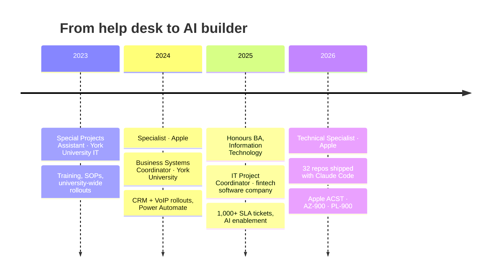

<h1 align="center">Hi, I'm Abdul 👋</h1>

<p align="center">
  <a href="https://ark310.github.io">
    
  </a>
</p>

<p align="center">
  <a href="https://ark310.github.io"></a>
  <a href="https://github.com/Ark310/portfolio"></a>
  <a href="https://github.com/Ark310/experience"></a>
  <a href="https://github.com/Ark310/portfolio/tree/main/certifications"></a>
  <a href="https://www.linkedin.com/in/abdulraqeebkhatri"></a>
  <a href="mailto:abdulraqeebkhatri310@gmail.com"></a>
</p>

---

**IT Support & Systems professional who automates the boring and builds with AI.**
By day I keep people and systems running: Tier 1/2 support at Apple, 1,000+ SLA-driven tickets in fintech, and CRM and VoIP rollouts in higher education. The rest of the time I turn the repetitive parts into tools: browser automation, reporting pipelines and private RAG assistants, each one built for a real problem.

```text
   🔍  understand the problem   →   ⚙️  automate it   →   🧪  test it properly   →   📦  ship it   →   🔁  repeat
```

### 📊 By the numbers

| 🎫 1,000+ | 👥 250+ | 📦 32 | 🔁 1,000+ | ✅ 3,400+ | 📜 44 |
|:---:|:---:|:---:|:---:|:---:|:---:|
| SLA tickets managed | users supported | project repos | commits in 2026 | passing tests | credentials |

---

### 🧭 My journey



---

### 🚀 Featured work

<!-- showcase:featured:start -->
**[Knowledge Base Assistant](https://github.com/Ark310/knowledge-base-assistant)**: Scraper → markdown library → hybrid-RAG desktop chatbot with verified citations and an on-prem LLM option.  
📈 One desktop assistant answers from both the help site and past ticket resolutions, with clickable citations that are verified before they are shown.  
`Python` · `Playwright` · `ChromaDB` · `BM25/RRF` · `CrossEncoder`

**[BLNS: Sanctions Screening RAG](https://github.com/Ark310/blns-sanctions-screening-rag)**: Offline FLAG / REVIEW / CLEAR adjudicator for sanctions-screening alerts: deterministic OFAC-style scoring plus RAG over past analyst decisions on an 8 GB GPU.  
📈 Turns a manual queue into an advisory pipeline that recommends FLAG, REVIEW or CLEAR with cited precedents from about 1,271 historical analyst decisions. The analyst always decides.  
`Python` · `Ollama` · `ChromaDB` · `FastAPI` · `.NET 8`

**[Claude Sessions Tracker](https://github.com/Ark310/claude-sessions-tracker)**: Desktop dashboard for local Claude Code sessions: tokens, models, subagents and one-click session management.  
📈 One screen shows every session with live token usage summed from the transcripts, never estimated.  
`Python` · `CustomTkinter` · `Matplotlib` · `watchdog` · `SQLite`

**[Report Downloader](https://github.com/Ark310/report-downloader)**: One-click month-end PDF/Excel dashboard exports for about 30 clients, plus an auto-built billing CSV.  
📈 The whole month-end run happens unattended: pick clients, reports and month, press Start.  
`Python` · `Playwright` · `Tkinter` · `openpyxl` · `PyInstaller`

**[Incident Report Scraper](https://github.com/Ark310/incident-report-scraper)**: Scrapes a support portal's incidents into a change-tracked Excel workbook and an offline HTML dashboard with sentiment.  
📈 One click turns about 340 incidents into trends, leaderboards, backlog age and sentiment.  
`Python` · `Playwright` · `PySide6` · `openpyxl` · `VADER`

**[Weekly Time Reports](https://github.com/Ark310/weekly-time-reports)**: A portal-driven desktop app that replaced a hand-maintained weekly timesheet workbook.  
📈 Replaced the manual workbook with a one-click run that outputs Excel, PDF and a scheduled Outlook email.  
`Python` · `PySide6` · `Playwright` · `openpyxl` · `Outlook`
<!-- showcase:featured:end -->

> 👉 **[All 32 projects, each with why I built it and its impact →](https://github.com/Ark310/portfolio#gallery)**

---

### ⚡ What I do

- **Keep people productive:** Tier 1/2 support across macOS, Windows, iOS/iPadOS, Microsoft 365, Google Workspace, MDM and networking.
- **Automate the boring:** Power Automate flows, Playwright/Selenium bots and Python desktop apps that remove repetitive manual work.
- **Turn data into decisions:** reporting pipelines and dashboards (SQL, pandas, Excel, Power BI) that reconcile to the hour.
- **Build with AI, safely:** RAG pipelines, local LLMs and Claude Code plugins, with privacy, citations and tests built in.

---

### 🛠️ Toolbox

<details open>
<summary><strong>🤖 AI & Automation</strong></summary>


-742774?style=flat-square&logo=powerapps&logoColor=white)


</details>

<details open>
<summary><strong>🖥️ IT Support & Systems</strong></summary>


</details>

<details>
<summary><strong>💻 Languages</strong></summary>


</details>

<details>
<summary><strong>🌐 Web · Data · Cloud · Security</strong></summary>


-0078D4?style=flat-square&logo=microsoftazure&logoColor=white)


</details>

➡️ Every skill, and where I used it: **[skills matrix](https://github.com/Ark310/experience/blob/main/SKILLS.md)**

---

### 📜 Certifications

🍎 **Apple Certified Support Technician** · 🟦 **Azure Fundamentals (AZ-900)** · 🟪 **Power Platform Fundamentals (PL-900)** · 🔐 **Cisco** Network Support & Security, IT Customer Support, Cybersecurity · ☁️ **AWS SimuLearn: Cloud Practitioner** · 🤖 **Anthropic** Claude Code 101 · 📘 ITIL Foundation *(in progress)*

**[→ Browse all 44 in the certification gallery](https://github.com/Ark310/portfolio/tree/main/certifications)**

---

### 📈 GitHub activity

<p align="center">
  
  
</p>

<p align="center">
  <picture>
    <source media="(prefers-color-scheme: dark)" srcset="https://raw.githubusercontent.com/Ark310/Ark310/output/github-snake-dark.svg">
    
  </picture>
</p>

---

<p align="center">
  <em>Always learning. Always shipping.</em> ✨<br>
  💡 <em>Tip: open the <a href="https://ark310.github.io">site</a> and press <kbd>~</kbd>.</em><br>
  📫 <a href="mailto:abdulraqeebkhatri310@gmail.com">abdulraqeebkhatri310@gmail.com</a>
</p>
